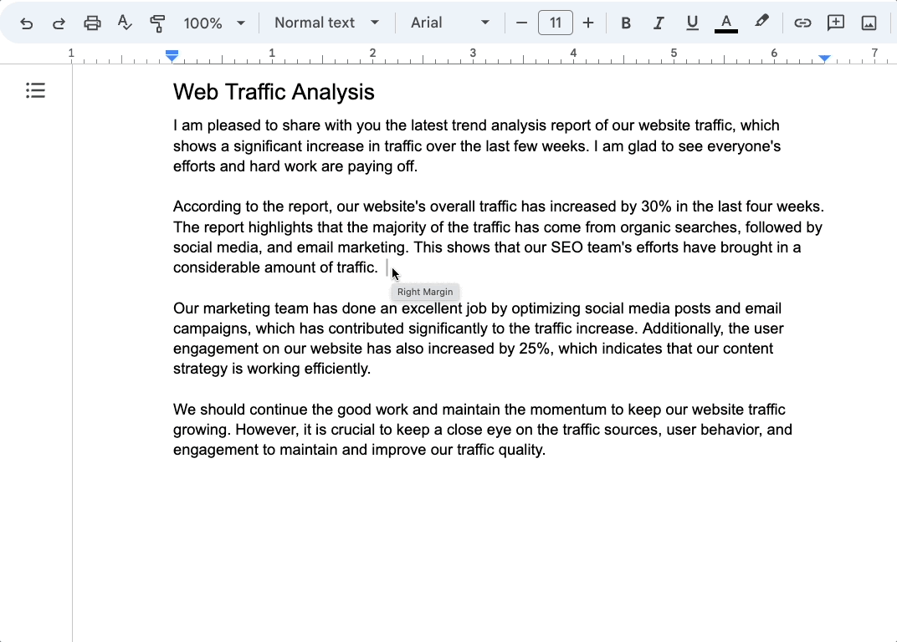
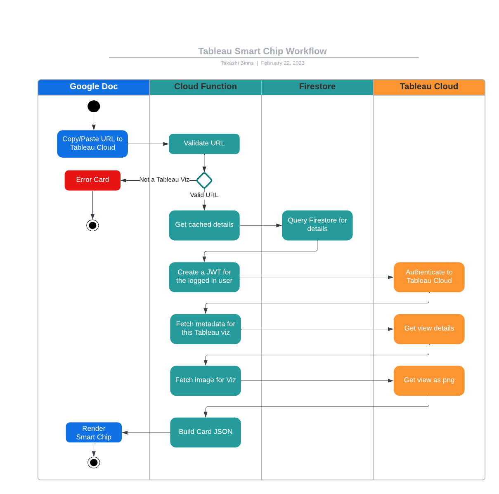
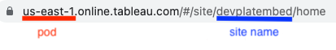
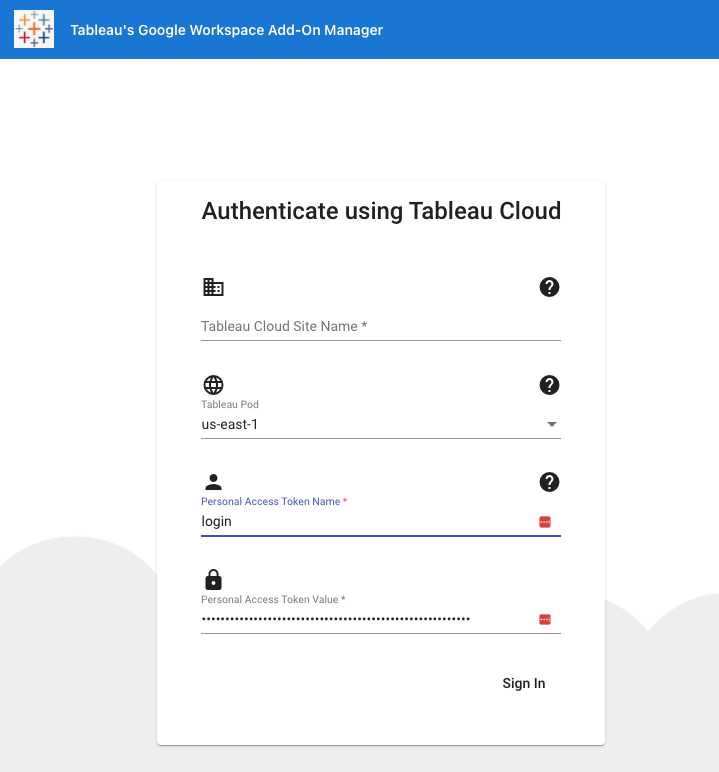
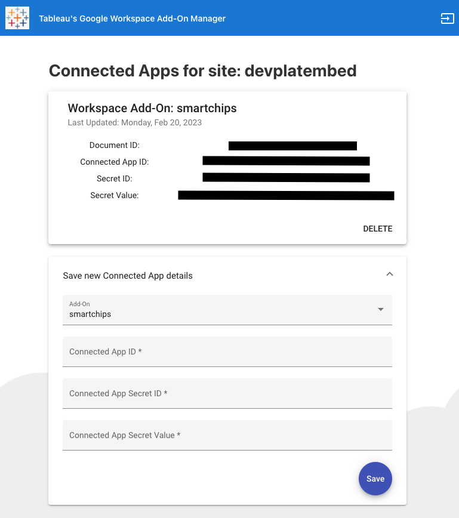
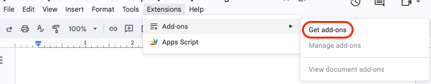

# Tableau Cloud // Google Workspace Integration

This document describes the integration between Tableau Cloud and Google Workspace.  It also details how to configure your Tableau Cloud environment to work with Google Workspaces.
## What does this do?
### Google Smartchips
[Google Smartchips](https://developers.google.com/chat/how-tos/preview-links) is a new feature of Google Docs that lets 3rd parties automatically create preview links based on a URL pattern.  Tableau created a Google Workspaces Add-On that detects automatically when a user copies/pastes a link to Tableau Cloud, and replaces it with a Smartchip.  

When you enter a Tableau Cloud URL (we assume it’s a link to a Tableau Viz), we lookup the name of the Viz and use that as the Smartchip’s label.  We also display some metadata and a preview image of the Viz, when you hover over the Smartchip.

## What do you need to use this?
### Tableau Cloud
This integration was built to make it easier to embed data analytics from Tableau Cloud into the Google Workspace environment.  In order to do this, **you must have a Tableau Cloud site** (Tableau Server is not supported).
### Google Workspace
Google Workspace is a suite of enterprise business solutions (gmail, google docs, calendar, sheets, etc) built by Google.  This integration was built on the Google Workspace platform, and we derive your email address from Google Workspace.  This means **your Google Workspace email must match the email you use to login to Tableau Cloud**.
## How does this work?
### Tableau REST APIs
In order to fetch metadata and a preview image of a Tableau Viz, this Add On uses [Tableau’s REST APIs](https://help.tableau.com/current/api/rest_api/en-us/REST/rest_api_ref.htm).  We split the URL of the Tableau Viz into different parts, to determine the Site, Workbook, and View names.  Once we have this, we can use the REST API to query for that view (metadata + image).  The responses are then put into a JSON structure and rendered using Google’s [Card UI](https://developers.google.com/apps-script/add-ons/concepts/cards).

In order to authenticate from Google Workspace to Tableau Cloud, we take the email of the logged in Google user and use a Tableau [Connected App](https://help.tableau.com/current/online/en-us/connected_apps.htm) to authenticate to Tableau as the logged in user.  This lets us provide a single sign on experience to the end users, while respecting their permissions as defined in Tableau Cloud.
### Swimlane Diagram
The below diagram outlines what happens when a user hovers over a Tableau Smartchip.  

## How to get started
### Tableau Cloud Admin
Before you can use the Add On, you will need a Tableau Cloud site admin to perform the following steps:
#### Create Tableau Connected App
Login to your Tableau Cloud site, and follow the steps [here](https://help.tableau.com/current/online/en-us/connected_apps_direct.htm#create-a-connected-app) to create a new ```Direct Trust Connected App```.  Since we’re using this for REST API authorization, you can ignore the Access Level and Domain allowlist settings.  Newly created connected apps are disabled by default, so make sure to use the action menu to ```Enable``` it.
#### Configure the Tableau Add-On
In order for Tableau’s Add On to use your new connected app, we need the app’s ID, secret ID, and secret value.  Open the [Tableau Google Workspace Add-On Manager](https://googleworkspaces.tableau.com), and authenticate to your Tableau Cloud site.  You’ll need to provide the site name and pod of your Tableau Cloud site (which you can get from the URL of your Tableau Cloud environment).



Instead of your Tableau Cloud username + password, you will need to use a Personal Access Token to login*. If you’ve never created a PAT before, follow the instructions [here](https://help.tableau.com/current/pro/desktop/en-us/useracct.htm#create-and-revoke-personal-access-tokens) to create one.  Just note that PATs are short-lived, if you don’t use it again within a 15 day window it will expire.



**Some sites may have single sign on enabled, which means users would not necessarily have a password to login with.  Also, Tableau Cloud supports multi-factor authentication (MFA) and that requires personal access tokens for signing in via the REST API.*

Once logged in, you should see a card for every Connected App related to the site you specified during login.  Every card has a delete button, in case you need to remove an old connected app’s details.  If it’s your first time saving credentials for this site, you will only see the *Save new Connected App Details* form.  


Copy and paste the connected app’s details from Tableau Cloud to this form, and click the Save button.  The page should refresh, and you will see your details populated.  

Repeat this process for each Tableau Cloud site you want to integrate with Google Workspace.  There is a logout button at the top right of the page which brings you back to the login prompt, if you need to login to a different site.

### Google Docs User
Before you can use this Add-On within Google Docs, you will need to install it from the Google Workspace Marketplace.  You can use the *Get add-ons* button from within a Google Doc,

or you can open the [Google Workspace Marketplace](https://workspace.google.com/marketplace) and search for Tableau.  Keep in mind that your Google Workspace administrator may have restricted what Add-Ons are available for users to install.  If that’s the case you may see the Add-On in the marketplace, but the Install button would be grayed out.  In this situation, you will need your Google Workspace administrator to [allow Tableau’s Add-On at an organization level](https://support.google.com/a/answer/6089179?hl=en#add_apps_allowlist).

## RESOURCES
### Documentation Links
* [Tableau REST APIs](https://help.tableau.com/current/api/rest_api/en-us/REST/rest_api_ref.htm)
* [Tableau Connected Apps](https://help.tableau.com/current/online/en-us/connected_apps.htm)
* Google Workspace [Preview Link](https://developers.google.com/chat/how-tos/preview-links)
### Limitations
* The Smartchips API will match on any URL from Tableau Cloud.  We will only display the smartchip properly, If the link is to a Tableau Viz (either the URL of a viz or the embed link).  All other links will show a generic message instead.
* This Add-On does not support query string parameters for setting filters/parameters.

### Issues
Feel free to ask questions or let us know of problems you see to one of these places:
* As an [issue](https://github.com/takashibinns/tableau-google-workspace-integration/issues) in this github repository
* The [Tableau Community site](https://community.tableau.com/s/explore-forums)
* Join the [Tableau Developer program](https://www.tableau.com/developer), then ask questions in the Slack workspace